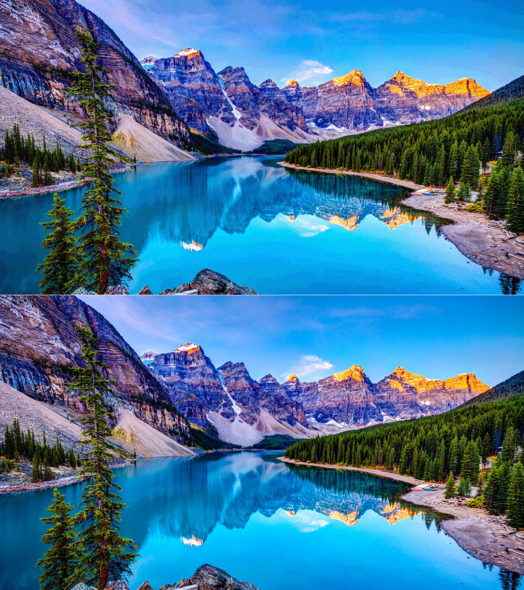
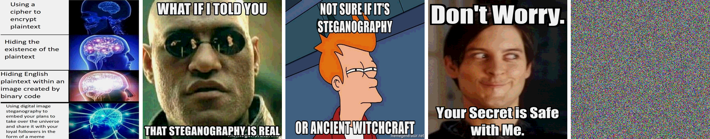
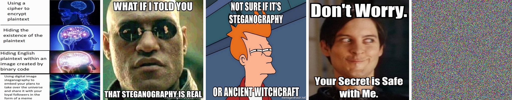
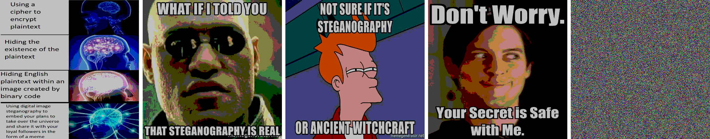

**Information Systems Security Project**

**Cihat Emre Çeliker, 20160808028**

***
# Hider
`"Steganography is the practice of concealing a message within another message or a physical object."`

Hider is a package that is capable of hiding text or images in an image using bit manipulation techniques and random number generators to make unbreakable encryptions.

***
## Method
There are a couple of different encoding options. All options require a key that is the same for both parties:

1. Smaller image or images in a bigger image:
    1. Calculate the volume of the bigger image. The product of the three dimensions.
    2. Resize the images that will be hidden to a specified size. This is a hyperparameter defined in the `hp.py` file.
    3. Divide the volume of the bigger image to the volume of a smaller image and determine how many small images can fit in the bigger one. This number is the maximum number of small images that can be hidden. It will be used when decoding.
    4. Flatten all the images and randomly generate indexes for all images that will be hidden, in a way that no hidden image will overlap.
    5. Put the smaller images into the randomly generated indexes. Let's say:
        - A value of the bigger image represented in a byte is:
            - P1 = 0110 1010
        - A value of the smaller image represented in a byte is:
            - P2 = 1011 0001
        - To combine these two values, simply, the smaller image's most significant 4 bits will be the combined image's least significant 4 bits. So the resulting value is:
            - P3 = 0110 1011
            - First 4 bits are the bigger image's most significant bits and the last 4 bits are the smaller image's most significant bits.
        - For all the generated indexes for the smaller image, these steps are done and the smaller image is hidden in the bigger one. If the hidden data is not needed to be at the highest quality as possible, a way more secure way would be to combine these two bytes using 6 bits from the bigger image and only 2 bits from the smaller one.
    6. Return the bigger image with hidden images in it, after reshaping it to the original size.
    * To extract the hidden images from a bigger image, the steps are reversed.
        - The same key is used to generate indexes.
        - Both parties don't need to communicate the number of hidden images. The decoder will find the maximum number of possible hidden images, will generate indexes, and will return all found images. For example, if there are 4 hidden images and the maximum number of hidden images is 8, the decoder will return 8 images. The first 4 are the hidden ones, the rest is just noise.

2. Text in image:
    1. Add padding to the text to make it the same size as the max possible text size that is defined in the `hp.py` file.
    2. Convert the text to an array of 1's and 0's.
    3. Generate random indexes using the key.
    4. Flatten the image.
    5. Convert the least significant bits of the flattened image's chosen indexes to the bits of the text.
    6. Add salt to randomly chosen indexes to prevent someone with the original data to extract the shuffled bits of the hidden text.
    7. Return the image that has text hidden in it after removing the padding.
    - To decode it, steps are reversed, the key directly gives the indexes of bits of the hidden text.

***
## Results

`Without using the random number generators, any data that is hidden can easily be extracted if someone knows where to look. However, hiding the data using randomness, makes it impossible(chances are really low, but not 0) to crack even if someone has the original data. Any hidden data is just noise without the right key. It's surprising to see how much data can be hidden into an image with just some minor tweaks to bytes.`
***
## Experiments

* ### Image in image

For the experiments, 4 important images will be hidden in a cover image.
```python
from PIL import Image
from src.hider.core import image_in_image

image_fn = ["figs/cover_image.jpg", 
            "figs/hidden1.jpg", "figs/hidden2.png", 
            "figs/hidden3.jpg", "figs/hidden4.png"]
images = [Image.open(image) for image in image_fn]

# encoding
image_with_hidden_images = image_in_image(*images, key=1)

# decoding
hidden_images = image_in_image(image_with_hidden_images, key=1)
```

Now let's see the difference. Which one is the original?



The bottom one is the original and the upper one is the image with hidden images in it. A little bit of difference can be seen in the color of the sky.
***
Now let's see the hidden images extracted from the cover image.



When decoding the image, the decoder doesn't know the number of hidden images in the given image, so it will extract all it can. This is the reason for the last one on the right.

The experiments on top are done using the default value for the `ratio` parameter, 4. This parameter chooses the number of bits taken from the cover image. More ratio means higher quality for cover and lowers for hidden images and vice versa. 

Now let's try different ratios.

***
For ratio 2, we keep 2 bits from the cover and 6 bits from the hidden images.


Now the difference in the cover image is much more obvious and the hidden images have a bit higher quality, 2 bits per value.



***

For ratio 6, we keep 6 bits from the cover and 2 bits from the hidden images.


Now the difference in the cover image is almost impossible to tell with the human eye and the hidden images have much lower quality, 2 bits per value.



***

The value of the ratio should be as high as possible for as much invisibility as possible.


* ### Text in image


An example code to hide text in an image.
```python
from PIL import Image
from src.hider.core import text_in_image

image = Image.open("figs/cover_image.jpg")

text = """Lorem Ipsum is ......... istic words etc."""

# encoding
image_with_text_in_it = text_in_image(image, key=1, text=text)

# decoding
hidden_text = text_in_image(image_with_text_in_it, key=1)
```

Since hiding text in an image requires only changing a bit, the resulting image is impossible to differentiate from the original one, therefore we'll not show it here.

### Note:
* To be able to transfer an image with data hidden in it without a loss of information, use `png` file format, most of the other formats(`jpg`, `jpeg`, etc.) are lossy.
* The images can easily be saved using `image.save("[filename].png")`.
